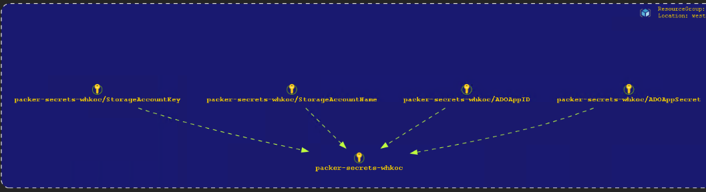
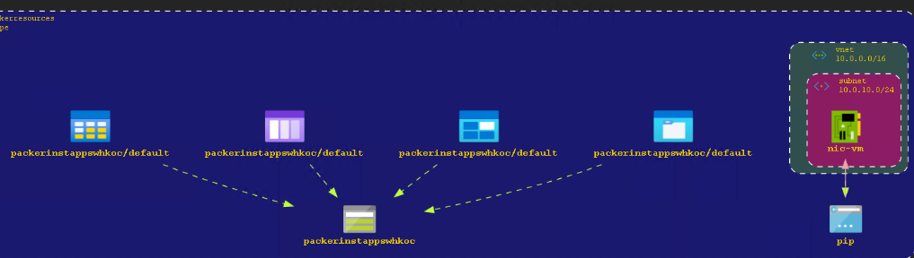
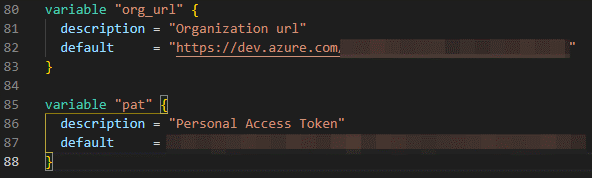
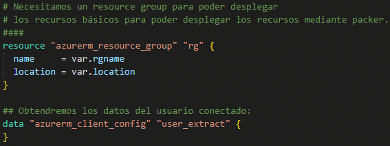
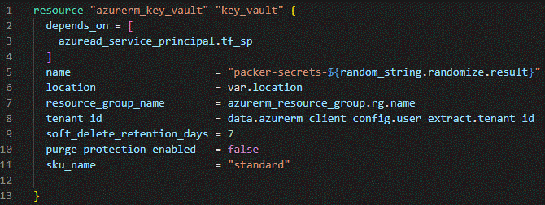
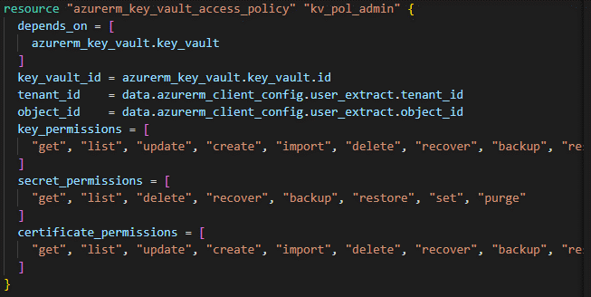
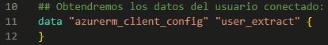

# Infraestructura como código: Realización de una golden image de Windows 10 multi-session + o365.  

---

Microsoft Azure © and Azure Devops © are trademarks of Microsoft ©.

Terraform © and Packer © are trademarks of Hashicorp ©.

## Referencias.

Este tutorial se ha realizado gracias en base al trabajo de varias
personas en internet que han compartido sus conocimientos. Es por ello
por lo que quisiera dejar constancia de la gente a la cual me ha
inspirado:

[Tom Hickling visita su blog.](https://xenithit.blogspot.com/2020/03/how-to-deploy-windows-virtual-dekstop.html)  

[ParveenSingh visita su blog.](https://parveensingh.com/packer-golden-vm-image-with-azure-devops/#create-new-azure-devops-organization-and-project)

[Robert Przybylski visita su blog.](https://www.azureblog.pl/2020/11/15/windows-virtual-desktop-deployment-4-5/#7-azure-file-share-configuration)

[Jake Walsh visita su blog.](https://jakewalsh.co.uk/azure-devops-using-packer-to-create-images/)

[Adin Ermie visita su blog.](https://adinermie.com/deploying-azure-devops-ado-using-terraform/)

# Infraestructura como código: Realización de una golden image de Windows 10 multi-session + o365.

Gracias a los numerosos avances dentro del entorno cloud, \"está\"
apareciendo con fuerza una nueva forma de realizar los despliegues de
nuestros sistemas operativos, a esta manera de desplegar se llama:
**Infraestructura inmutable**.

En los contenedores podemos cambiar de versión de apache o cambiar de
servicio web sin tener que lidiar con las versiones o dependencias
gracias a la infraestructura inmutable. Descartamos el contenedor y
lanzamos uno nuevo con la versión deseada.

En definitiva: Hacemos la infraestructura desechable.

Vamos a aplicar éste mismo concepto, pero en el escritorio de Windows
para Azure Virtual Desktop. Suponiendo que usamos FSLogix para almacenar
la información del usuario, podremos usar la infraestructura inmutable.

Una vez realizada la introducción a la Infraestructura Inmutable,
pasamos al tutorial.

## ¿Qué vamos a realizar en este tutorial?

En este tutorial vamos a utilizar:

-   Azure Cloud.

-   Azure DevOps.

-   Hashicorp Packer.

-   Hashicorp Terraform.

# ¿Qué vamos a desplegar?

Dentro del mundo DevOps, a menudo se requiere del conocimiento de uso de
diferentes herramientas, en esta ocasión vamos a generar una *Golden
Image* de Windows 10 multisesión + office 365 mediante Packer, pero con
un toque diferente.

Vamos a utilizar Terraform para desplegar la infraestructura necesaria,
usaremos los pipelines de Azure DevOps para generar una Golden Image
mediante Packer:

-   Grupo de recursos:
    -   Donde se desplegarán los recursos y la imagen final de Windows.

-   Azure DevOps:
    -   Repositorio y pipelines para generar la imagen de Windows.

-   key Vault:
    -   Para el almacenamiento de claves.

-   Storage account:

    -   Donde subiremos los scripts para la configuración de la **Golden image**.

-   Service Principal:

    -   Cuenta para realizar las tareas para generar la *Golden image*.

-   Proyecto Azure DevOps:

    -   Donde alojaremos el repositorio.

-   Repositorio en Azure DevOps:

    -   Donde subiremos los archivos: Packer.json y azure-pipelines.yml

-   2 grupos de variables para los pipelines:

    -   Uno de ellos importando las variables desde el key vault.

*Infraestructura del despliegue mediante el módulo AzViz.*

Tal y como ilustra la imagen de arriba, podemos ver arriba a la
izquierda el Service Principal y sus dependencias que desplegaremos más
adelante.

# Contenido del despliegue.

He creado los archivos de Terraform para representar los recursos que
vamos a desplegar:

Contenido carpeta despliegue

# **Explicación de cada archivo.**

## Providers.tf

archivo providers.tf

Archivo providers.tf indicaremos los providers que utilizaremos. En el
caso del key vault, habilitamos que elimine el soft delete antes de
eliminar el recurso. En el provider de azuredevops introduciremos la url
de nuestra organización y el Personal Token Access:

variables providers.tf

## Main.tf

RG y extracción de datos del usuario

Storage Account y un file share

En este archivo, estamos creando un Storage Account con un nombre
packerinstapps+5 letras random.

Randomize

Con el random string randomize generamos un string de 5 letras para
hacer único el nombre del storage account.

Creamos un file share con un nombre "installers" donde crearemos una
carpeta llamada scripts y alojaremos los archivos de configuración y
scripts para maquetar nuestra imagen.

## Ad_sp.tf

Aquí vamos a crear nuestro Service Principal, darle el rol de
contributor y la contraseña con una duración:

SP y rol contributor

password para el SP

Con random_password generamos una clave de longitud de 32 caracteres.
También pondremos la contraseña una caducidad, en este caso, de 8760
horas.

## Az_keyvault.tf

Declaración del key vault

Generaremos un Key Vault con un nombre único (usaremos otra vez el
randomize)

key_vault access policy

En este campo, añadiremos el administrador del key vault con los
permisos necesarios. Le pasaremos el tenant_id y el object_id mediante:

data extraction

Si quisiéramos poner a otro usuario del tenant como administrador,
tendríamos que conocer su object_id.

key_vault access policy 2

Aquí daremos al SP acceso al key vault (los permisos hay que adecuarlos
a las necesidades, esto es un entorno privado). Como antes, extraeremos
el tenant del data-\>user_extraction. El object_id del SP mediante las
redirecciones de datos Terraform.

key_vault secrets

Definiremos los secrets en el key vault como hemos utilizado antes,
mediante redirección de los datos de Terraform.

El depends_on es una manera de forzar a Terraform que despliegue
solamente cuando la policy de acceso del SP se haya creado.

## Az_networking.tf

Generaremos una virtual network, subnet y un NSG para tenerlo preparado
para cuando tengamos la imagen y poder hacer pruebas.
[Parveen](Phttps://parveensingh.com/packer-golden-vm-image-with-azure-devops/#create-new-azure-devops-organization-and-project)
indicaba que era necesario para la creación de la imagen, pero no es
necesario. Tengo creada una public ip para mis pruebas, no afecta al
tutorial.

Del archivo muestro la parte del NSG para ver la forma en la que
extraigo mi ip pública y se la paso al nsg

NSG usando web para mi ip publica

Con data httphttp://icanhazip.com conseguimos la ip pública de nuestra
vivienda y se la pasamos con chomp(data.http.icanhazip.body).

## Az_vars.tf

declaración de variables

## ADO_project.tf

declaración project en Azure DevOps

Declaramos un proyecto nuevo en nuestra organización en versión de
control Git, la visualización y los features que queramos usar (en este
caso, testplans no lo usaremos).

declaración project en Azure DevOps

Aquí creamos un repositorio nuevo donde subiremos los 2 archivos
necesario para hacer nuestro pipeline:

Packer.json y azure-pipelines.yml

declaración project en Azure DevOps

Aquí declaramos el endpoint para conectar el SP del tenant y Azure
DevOps y le daremos autorización.

## ADO_variables.tf

Azure DevOps declaración grupo variables

Azure DevOps declaración grupo variables

  

Azure DevOps declaración grupo variables

Muchas de las variables se pueden modificar como: el tamaño de la
máquina que se crea provisionalmente, la zona de despliegue,etc...

**AVISO**. *El tamaño de la máquina temporal puede afectar puesto que hay un bug con WinRM que dará timeout. Si os sale un error de WinRM timeout, cambiad de tamaño de la vm.*

En el primer grupo de variables de pipelines, hemos generado las claves y valor, pero en el segundo grupo de variables hemos obtenido la claves mediante los permisos del key vault y del SP que tiene los permisos. Si tuviésemos más claves podríamos importarlas agregando la clave correspondiente.

## Outputs.tf

outputs.tf

Con este archivo, visualizamos los parámetros que declaramos y
necesitamos visualizar al final el despliegue. Hay outputs que no se
mostraran por tener la propiedad sensitive.

Siempre la podemos mostrar si la necesitamos ejecutando:

Terraform output sp_password

# Terraform init, plan y apply

Aquí no hay mucho que explicar. Solamente os saldrán las variables que
no hayáis declarado en los archivos. Yo creo un archivo azure_configs.tf
con la información clave dentro y que no debe ser compartida

azureAD provider 2.0 aviso

Para la versión 2.0 no se podrá generar "manualmente" la password del SP
y se generará automáticamente.

# Archivos para desplegar la Golden Image en Azure DevOps.

## Packer.json

Con Packer.json generamos la imagen de Windows 10 Multisesión + o365 y
ejecutamos los scripts que necesitemos.

Pasaros por la web de
[Parveen](https://parveensingh.com/packer-golden-vm-image-with-azure-devops/)
o su repositorio para los detalles:
<https://github.com/singhparveen/Packer-Image-Build>

## Azure-pipelines.yml

Con este archivo tendremos integración continua, construiremos la imagen
mediante Packer (plugin de Azure DevOps), obtendremos las variables
(plugin de Azure DevOps)

[]{#_Toc76462784 .anchor}Trigger, activaremos la integración continua.

[]{#_Toc76462785 .anchor}Name: Nombre del build.

Variables: Importamos los grupos de variables de la library en
pipelines.

## Stage

[]displayname: el nombre que se mostrará en el
pipeline

## Jobs

Job: Construcción de la imagen.

Displayname: el nombre que mostrará.

Pool: quien va a ejecutar el pipeline.

## Steps

Task: el nombre de la extensión del market place de Azure DevOps, en
este caso, Packer.

Usaremos la última versión cada vez que lancemos el pipeline.

Task: Construcción de la imagen mediante Packer.

CustomTemplateLocation: Archivo donde está la configuración para
realizar la construcción de la imagen.

CustomTemplateParameters: Declaramos unas variables del json con otras
que hemos declarado en el keyvault.

Task:

Esta extensión permite usar variables y guardarlas

Task:

Publish Build Artifacts:

Crearemos un artifact con el nombre de la máquina en formato json:

## Subir los scripts que usaremos al File Share.

Dentro de la carpeta installers, crearemos una carpeta scripts o
generamos la carpeta con Terraform, subiremos los scripts de powershell
que usaremos:

  
Listado de scripts que podríamos
utilizar. En la demostración voy a utilizar solamente el script
hello_world.ps1. Los demás scripts serían los de modificar el idioma de
Microsoft Windows 10 y scripts para optimizar el rendimiento.

## Os adjunto los enlaces de donde sacar los scripts de automatización:

[Install language packs on Windows 10 VMs in Azure Virtual Desktop -
Azure \| Microsoft
Docs](https://docs.microsoft.com/en-us/azure/virtual-desktop/language-packs)

[Optimizing Windows 10, Build 2004, for a Virtual Desktop role \|
Microsoft
Docs](https://docs.microsoft.com/en-us/windows-server/remote/remote-desktop-services/rds-vdi-recommendations-2004)

<https://github.com/Disassembler0/Win10-Initial-Setup-Script>

# Azure DevOps 

## Consideraciones.

Yo utilizo un agente privado en una máquina virtual que se la paso al
azure-pipelines.yml

También, le tengo puesto que automáticamente se auto aprovisione en los
proyectos que se vayan creando.

Otra consideración, actualmente estoy puliendo detalles de importar un
repositorio de github pero no está al 100% aún.

# Visualizando lo desplegado.

Una vez desplegado con Terraform apply, visualizamos lo que nos ha
desplegado:

*RG con los recursos.*  

  
*Azure DevOps Repository.*  

Para mostrar el repositorio importado de Github, en files, pinchamos en la parte de los repositorios y seleccionamos el importado:

*Menú para seleccionar el repositorio adecuado.*  

  
*Los grupos de variables que definimos en el despliegue.*  

    
*Mostrando las variables del Key Vault.*

  
*Mostrando las variables y los secrets.*  

# Creando el pipeline.

Con el repositorio importado y seleccionado, podemos ejecutar nuestra primera build:

Ejecutamos el pipeline

Hay que aceptar el consentimiento del agente:

El proceso tardará dependiendo de los scripts que le pongamos.

  

Una vez que empieza el build, podemos acceder al grupo de recursos temporal y visualizar los recursos desplegados.

*RG paralelo temporal de la VM.*  

En este grupo paralelo se ejecuta la instancia de la máquina y se le
pasan los scripts y luego creará la imagen en nuestro grupo de recursos.
Una vez se capture la imagen a nuestro grupo de recursos, el temporal lo destruirá Packer.

*Script ejecutado desde el file share.*

Vemos como continúa nuestro despliegue y la ejecución de scripts. Lo
último que realizaría sería el sysprep que tenemos al final del Packer y nos aseguramos de que ciertamente es lo último que ejecuta.

  
*sysprep ejecutado y apagando la máquina.*  

  
*Imagen Desplegada.*

*Imagen desplegada en nuestro RG.*

Ya tenemos la imagen creada y en nuestro grupo de recursos.

Con esto ya hemos acabado el pipeline y podíamos crear una máquina
virtual con la imagen.

El tamaño de la vm que declaramos en Packer es solamente la temporal y con la que se genera la imagen, podemos poner una potente para que los scripts se ejecuten más rápido.  

Solamente, nos quedaría crear una VM desde la imagen.
